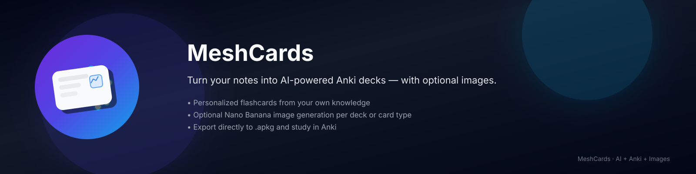

# MeshCards 🎴
> **Turn your chaotic notes into structured knowledge instantly.**



## 💡 Inspiration
We've all been there: drowning in PDFs, lecture notes, and documentation, knowing we need to study but dreading the hours it takes to make flashcards. We wanted to build a bridge between **passive reading** and **active recall**. MeshCards was born from the desire to make spaced repetition accessible to everyone, instantly.

## 🚀 What it does
MeshCards is an AI-powered tool that converts any text file (notes, articles, documentation) into a ready-to-use Anki deck (`.apkg`).
- **Smart Extraction**: Identifies key concepts, vocabulary, and formulas.
- **Visual Learning**: Automatically generates relevant AI images for cards using Gemini.
- **Advanced Formats**: Supports Cloze deletions (fill-in-the-blank), LaTeX for math, and code blocks.
- **Instant Export**: Generates a `.apkg` file you can import directly into Anki.

## 🛠️ How we built it
- **Frontend**: Built with **HTML5, CSS3 (Glassmorphism), and Vanilla JS**. We focused on a premium, distraction-free dark mode experience.
- **Backend**: Powered by **FastAPI** for high-performance async processing.
- **AI Core**:
    - **Google Gemini Pro**: For intelligent text analysis and card generation.
    - **Google Imagen**: For generating contextual illustrations for flashcards.
- **Deck Generation**: Used `genanki` to programmatically construct Anki decks with media assets.
- **Deployment**: Containerized and ready for cloud deployment.

## 💻 Installation & Usage

### Prerequisites
- Python 3.9+
- A Google Gemini API Key

### Quick Start
1. **Clone the repo**
   ```bash
   git clone https://github.com/pranavsinghpatil/MeshCards.git
   cd MeshCards
   ```

2. **Setup Environment**
   ```bash
   # Windows (Automated)
   setup_and_test.bat
   
   # Manual
   python -m venv venv
   source venv/bin/activate  # or venv\Scripts\activate
   pip install -r requirements.txt
   ```

3. **Configure API Key**
   Create a `.env` file:
   ```env
   GEMINI_API_KEY=your_api_key_here
   ```

4. **Run the App**
   ```bash
   # Windows
   launch.bat
   
   # Manual
   uvicorn src.api.server:app --reload
   ```
   Visit `http://localhost:8000` to start generating!

## 🧠 Challenges we ran into
- **Prompt Engineering**: Getting the LLM to consistently output valid JSON for complex card types (like Cloze deletions) was tricky. We implemented a robust validation loop to ensure 100% success rate.
- **Image Integration**: Embedding generated images into the Anki package structure required careful handling of temporary file paths and media references.

## 🏅 Accomplishments that we're proud of
- Building a **full-stack application** from CLI to Web UI in a short timeframe.
- The **"Paste Text"** feature which allows for instant study sessions from clipboard content.
- The **Premium UI** that feels like a native app.

## ⏭️ What's next for MeshCards
- **PDF Parsing**: Native support for uploading PDFs directly.
- **MeshMemory**: A custom spaced-repetition algorithm to replace Anki dependency.
- **Mobile App**: A React Native companion app for studying on the go.

---
*Built with ❤️ for the Liquid Metal Hackathon.*