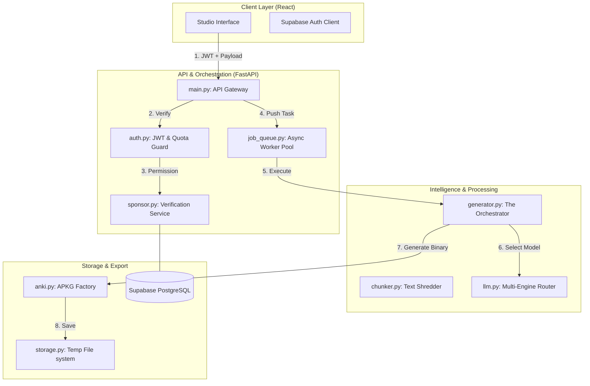
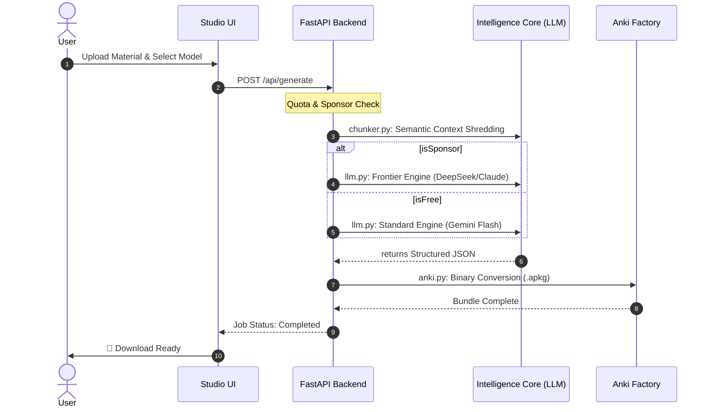

# 🔄 Generation Workflow & Logic

This document details the complete path of a request through the MeshCards backend, from authentication to final `.apkg` conversion.

## 🗺️ System Architecture

The following diagram illustrates the relationship between the client, API gateway, and the intelligence core.

---

## 🚦 End-to-End Logic Flow

### 1. Authentication & Access Tiering
Users authenticate via Supabase. The system immediately checks their tier:
*   **Tier: User (Free)**: Restricted to 1 deck per 24 hours. Uses Standard Engines (Gemini 1.5 Flash).
*   **Tier: Verified Sponsor**: Unlocks 5 decks/day and grants access to Frontier Engines (Llama 3.3, DeepSeek) via system-provided keys.

### 2. Document Ingestion & RAG
When a document is uploaded:
1.  **Extraction**: `chunker.py` normalizes formatting and strips non-text elements.
2.  **Semantic Chunking (RAG)**: The text is sliced into overlapping semantic blocks. This ensures that when the AI is prompted, the context bridge between sections isn't lost.
3.  **Context Injection**: Only the most relevant content is served to the prompt to maintain high signal-to-noise ratios.

### 3. Model Selection & Prompting
The `llm.py` client dynamically selects the engine based on the user's tier and requested complexity:
*   **Prompt Engineering**: Our system uses Capable Prompting—specifically optimized instructions that vary based on the model's architecture (Gemini vs OpenRouter/Novita).
*   **Structuring**: The prompt explicitly handles the conversion to JSON format, which is required for the downstream builder.

### 4. Generation & Conversion

## 🏗️ Technical Registry

| Component | Responsibility |
| :--- | :--- |
| **`generator.py`** | The "General" of the backend. Orchestrates the flow. |
| **`llm.py`** | Standardized interface for multi-engine communication. |
| **`chunker.py`** | Handles RAG-style text preparation for LLM ingestion. |
| **`anki.py`** | Packages JSON data into valid SQLite-based binary decks. |
| **`auth.py`** | Manages IST-based quota reset logic and session validation. |
